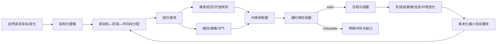

# 易程智策核心技术交接书（国二等奖硬目标）

> 版本日期：2026-07-29<br>
> 交接范围：核心技术、接口、测试和可复现证据<br>
> 不在本交接范围：PPT 美术、答辩视频剪辑、报名材料排版<br>
> 公网入口：<https://yicheng-agent.vercel.app/>

## 1. 当前判断

按核心技术维度，项目已经从“通用大模型问答 + 校园知识库”深化为
**可验证的校园时空决策智能体**，具备冲击国二等奖的技术竞争力。任何人都
不能诚实保证最终奖项，因为评审还取决于赛道、材料、演示稳定性和现场表达；
但后续不应再靠堆模型、堆智能体数量或虚构用户数据来增加“技术感”。

当前最值得讲的主线只有一句：

> 易程智策把跨日目标、个人课表、校园开放规则、地点通勤、天气和完成反馈
> 放进同一套可校验的周—日决策闭环，并在变化后以最小扰动生成可追溯新版本。

## 2. 与常见同类作品的差异

常见校园智能体作品集中在问答、通知、知识检索、聊天陪伴或单次文本生成。
易程智策不以“接入了某个大模型”作为创新，而以四项可运行能力形成区分：

1. **周—日分层决策**：周层分配目标和阶段，日层再用真实校园约束落地；
2. **确定性硬校验**：任务完整、课表、重叠、通勤、开放时间、截止和天气
   均由程序检查，模型不能自行改写硬边界；
3. **全局最小扰动**：变化后先最小化被移动的原任务数量，再最小化总位移；
4. **可审计证据链**：版本、触发原因、实体血缘、移动数、保留率、逐案例
   输出和冻结输入哈希都可复核。

“多智能体”不是数量竞赛。当前架构用状态图分离理解、上下文补全、规划、
校验和表达，再把精确优化交给确定性服务，职责比多个模型互相讨论更清楚。

## 3. 核心架构



边界划分：

- 大模型：理解自然语言、补充结构化语义、组织自然表达；
- Python：日期计算、候选生成、硬约束、排程、重排和指标；
- 校园知识：课程节次、场馆规则、活动时段和制度依据；
- 在线服务：高德地点、路线和天气；
- SQLite：用户数据、周计划版本、日计划、完成事件和运行轨迹。

## 4. 三项核心技术深化

### 4.1 周分配到日计划的真实落地

接口：

```text
POST /api/v1/weeks/{plan_id}/days/{date}/materialize
```

落地流程：

1. 读取当天仍有效的周分配；
2. 使用 `lineage_id` 生成跨版本稳定任务 ID；
3. 合并个人课表和校历后的固定课程；
4. 解析校园地点，加载路线、拥堵、开放规则、活动窗口和天气；
5. 把周层建议时段作为软偏好交给最小扰动排程器；
6. 运行硬约束校验；
7. 仅在计划有效时保存，并回写 `daily_plan_id`；
8. 重复请求返回同一有效结果；新增或取消分配后会重新落地完整当天计划。

不可行结果不会伪装成成功，也不会把任务静默丢弃。

### 4.2 日级有界全局最小扰动

旧策略逐任务选择局部最低成本，可能出现：

```text
旧计划：A 10:00，B 11:00
新固定活动：10:00
局部贪心：A→11:00，B→12:00，共移动 2 项
全局方案：B 保持 11:00，A→12:00，只移动 1 项
```

当前排程器在存在旧计划时使用有界 beam search。候选先满足硬约束，再按
以下元组做词典序比较：

```text
(
  未安排任务数,
  被移动的原任务数,
  总位移分钟,
  通勤/偏好/依赖延迟软代价,
  确定性时间表签名
)
```

这保证软偏好不会用分数“抵消”任务丢失或额外移动。专门反例测试已经验证
上述两项移动与一项移动的差异。

### 4.3 周级事件滚动重排

接口：

```text
POST /api/v1/weeks/{plan_id}/replan
```

支持触发：

- `daily_rollover`
- `task_incomplete`
- `new_task`
- `fixed_event_changed`
- `weather_changed`
- `manual`

规则：

- 冻结已完成、锁定和当前仍在执行的时间块；过期但未完成的块允许回收；
- 保留仍在最新容量内且满足依赖/截止的未来时间块；
- 只补排剩余时长未被覆盖的部分；
- 分配块持久化 `completed_duration_min`，部分完成后只把未完成分钟滚入未来，
  指标、负载与覆盖量均不重复计算；
- 新任务通过 `additional_goals` 增量加入，不重传原有全部目标；
- 新增硬截止任务无空位时，先最小驱逐可移动柔性旧块，再把旧块安置到剩余
  容量，不能为了保留率把客观可行方案误报为无解；
- 新版本不覆盖旧版本，并拒绝从过期基线继续并发分叉；
- 旧版本的重排、完成事件和每日落地入口统一拒写；
- 目标、阶段和时间块使用新数据库主键，同时保留稳定 `lineage_id`；
- `source_allocation_id` 指向直接来源时间块；
- 输出 `moved_allocation_count` 和 `preservation_rate`。

冻结块若与新容量冲突，系统保持不动并返回 `infeasible + issue`，不会暗中
违反用户锁定。

每日落地把周建议时段作为软偏好；若课程或校园约束占用首选时段，可在同日
候选窗口内寻找可行位置。最终 Plan、PlanItems 和周分配绑定在同一 SQLite
事务中发布；并发请求只返回同一胜出计划，插入中途失败会整体回滚。若排程
期间完成进度或分配窗口发生变化，接口返回可重试
`WEEKLY_GROUNDING_SNAPSHOT_CHANGED`（409），不会发布过期快照。
完成事件、绑定和日落地发布都会在写事务内再次校验目标计划仍是最新版本；
V2 保存还会对重排前的完整基线做指纹 CAS。事件与重排并发时，只允许其中
一个基于当前状态成功，另一方返回 `WEEKLY_PLAN_SUPERSEDED` 或可重试的
`WEEKLY_REPLAN_SNAPSHOT_CHANGED`，不会静默丢失刚记录的完成进度。

## 5. 可复现技术证据

冻结数据：

- 24 个确定性场景；
- 12 个首次规划，12 个事件重排；
- 固定种子：`20260729`；
- 数据 SHA256：
  `ee8a013111212982d83080c94a43b69377b3e053eb7aeb0147414da748356e5f`。

| 方法 | 可行完成率 | 硬约束违反 | 截止满足率 | 总体保留率 | 无关任务误移动率 | 总位移 |
|---|---:|---:|---:|---:|---:|---:|
| 贪心最早插入 | 33.3% | 19 | 50% | 2.8% | 95.5% | 9755 分钟 |
| 约束排程，关闭历史 | 100% | 0 | 100% | 2.8% | 95.5% | 9155 分钟 |
| 完整约束 + 最小扰动 | 100% | 0 | 100% | 72.2% | 0% | 1035 分钟 |

解释：

- 约束排程消融证明“硬约束层”带来可行性和截止收益；
- 关闭历史消融证明“最小扰动目标”显著减少计划震荡；
- 总体保留率包含本来就必须移动的冲突任务，因此不宣称 100%；
- 22 个标注为不应受影响的任务全部保留，这是更直接的误移动证据。

报告：

- `docs/TECHNICAL_BENCHMARK.md`
- `reports/planning_benchmark.md`
- `reports/planning_benchmark.json`
- `tests/fixtures/planning_benchmark_cases.json`

## 6. 本次验收结果

```text
Python 自动化测试：296/296
核心周闭环回归：41/41
规划算法冻结基准：24/24 可行
硬约束违反：0
带截止任务满足：8/8
不应受影响任务误移动：0/22
修改文件静态检查：通过
Python 编译检查：通过
git diff --check：通过
```

复现命令（D 盘环境）：

```powershell
Set-Location D:\APP\Dev\repos\yicheng-agent
& D:\APP\Dev\Python\envs\yicheng-agent\Scripts\python.exe -m pytest
& D:\APP\Dev\Python\envs\yicheng-agent\Scripts\python.exe scripts\run_planning_benchmark.py
```

## 7. 交给 PPT 与演示同学的四页证据

本文件不代做 PPT，但材料同学应围绕以下四页取材：

1. **真实痛点**：跨日目标会同时受到课表、地点、开放时间、天气和临时变化影响；
2. **技术闭环**：周分配 → 日落地 → 硬校验 → 事件重排；
3. **关键反例**：局部贪心移动两项，全局最小扰动只移动一项；
4. **可复现实测**：三方法基线/消融表和 296 项自动化测试。

推荐现场演示顺序：

1. 自然语言生成含阶段依赖的周计划；
2. 落地某一天，展示课程、路线、场馆和天气证据；
3. 新增一个临时任务或改变某日容量；
4. 生成第 2 版，展示保留率、移动数和前后差异；
5. 打开逐案例基准报告，说明结论可复现。

不要在现场只演示“问一句、模型答一段”；那会把最强技术降级成普通聊天。

## 8. 可使用与禁止使用的表述

可使用：

- “24 个冻结确定性场景中，完整策略可行完成率 100%，硬约束违反为 0。”
- “在 22 个明确不应受影响的任务上，完整策略误移动为 0。”
- “周分配必须经过日级校园约束校验后才进入日程。”
- “重排保留版本、触发原因、血缘、移动数和保留率。”

禁止使用：

- “30 名学生试用满意率……”——当前没有该数据；
- “所有场景准确率 100%”——冻结集不能代表全部真实分布；
- “全国高校均已落地”——当前知识底座固定为杭电下沙校区；
- “获国二等奖没有问题”——奖项不能由技术测试保证；
- “多个大模型自主协商得到最优解”——当前实现不是这一机制；
- “离线模式是产品特色”——正式体验保持联网，冻结数据只用于复现和降级。

## 9. 关于 30 人试用

当前暑假和时间条件下，不强行组织 30 名以上不同年级学生，也不补造问卷。
技术交付使用可复现基准、消融、反例、接口和回归测试作为主要证据。若提交
前还有少量时间，可以邀请少数学生用各自真实任务做走查，保留原始输入、
系统输出和修改意见；这些记录只能作为案例观察，不能外推总体满意率。

## 10. 当前边界

- 当前校园规则和知识重点覆盖杭州电子科技大学下沙校区；
- Vercel 临时实例不等于正式持久化生产数据库；
- 浏览器通知依赖授权，关闭网页后的提醒依靠导出系统日历；
- 有界 beam search 是可控时间内的全局近似搜索，不宣称数学意义上的无界最优；
- 冻结基准证明算法在明确输入上的行为，不替代长期真实用户研究；
- 面向普通用户的周时间块锁定/解锁界面仍可由后续产品同学补充，底层
  `locked` 约束已实现。

## 11. 核心文件索引

| 能力 | 文件 |
|---|---|
| 日级有界全局最小扰动 | `app/services/scheduler.py` |
| 日级重排入口 | `app/services/replanner.py` |
| 周目标分配 | `app/services/weekly_allocator.py` |
| 周级事件重排 | `app/services/weekly_replanner.py` |
| 周分配按日落地 | `app/services/weekly_grounding.py` |
| 周计划版本与事件仓储 | `app/repositories/weekly.py` |
| 周计划 API | `app/api/weeks.py` |
| 硬约束校验 | `app/services/validator.py` |
| 冻结基准脚本 | `scripts/run_planning_benchmark.py` |
| 基准专项测试 | `tests/unit/test_planning_benchmark.py` |
| 周重排专项测试 | `tests/unit/test_weekly_replanner.py` |
| 周—日闭环集成测试 | `tests/integration/test_weekly_grounding.py` |
